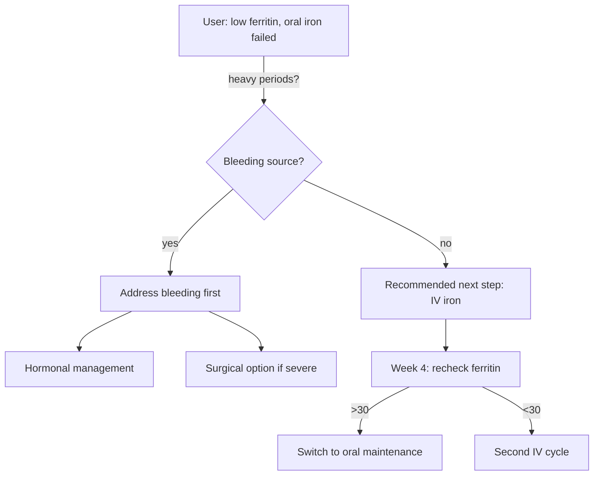
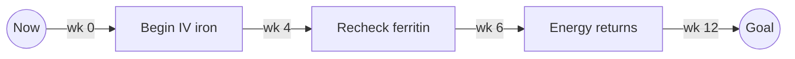
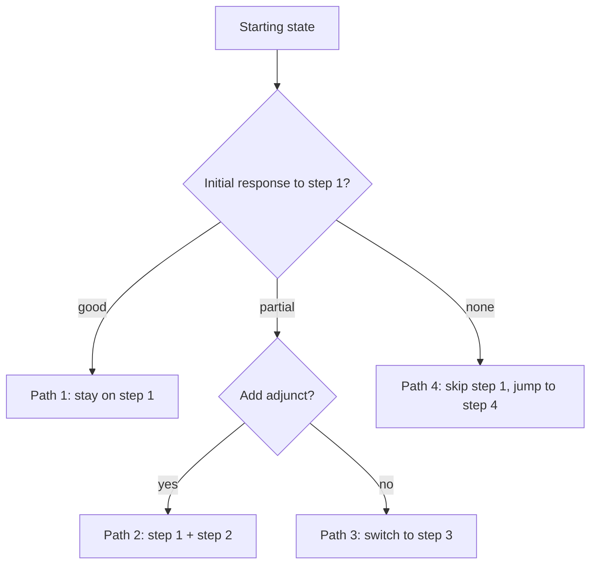

# Study writing guidelines

**The final deliverable is a PDF.** Every study is written as markdown (`study_<slug>.md`) and then rendered to **`study_<slug>.pdf`** — the PDF is what the user receives — inside the date-first study folder `<YYYY-MM-DD>_study_<slug>/`. Generate it with `python3 scripts/build_pdf.py <folder>/study_<slug>.md` (uploads the markdown to the studyd `/render_pdf` endpoint, which returns a print-styled PDF with Mermaid diagrams rendered to images — no local PDF tooling needed). A study is not finished until the PDF exists and has been sanity-checked for rendering. The structure below is required — don't skip sections, but keep each one tight (no padding to look thorough).

**The study's job is to help the user take their next concrete step toward a stated goal**, using two complementary sources of evidence:

1. **The corpus** — what worked, what didn't, in what order, for posters who started where the user is now.
2. **The scientific literature** — what RCTs, meta-analyses, and mechanistic research say about each step. Consulted via targeted web searches at writing time.

The corpus tells you what people actually do; the literature tells you whether the data supports it. The study fuses both.

## Use diagrams where they help

**⛔ Every diagram must be a real, rendered graphic — NEVER ASCII art, and the delivered PDF must
NEVER contain raw diagram SOURCE (this rule must never be dropped in a refactor).** Use **Mermaid**
fenced blocks (```` ```mermaid ````); the PDF renderer turns them into images automatically. The
reader must see a *picture*, never a "Diagram N (Mermaid source):" code dump. **If a diagram fails to
render** (renderer unreachable, syntax error) → fix the syntax and re-render, or OMIT the diagram
entirely — never ship the raw source as a fallback. After building, spot-check the PDF: any visible
`graph TD` / `flowchart` / mermaid keywords in the body = a rendering failure to fix before delivery.
Do not draw boxes/arrows/trees out of `-`, `|`, `+`, `└`, etc. in a code block — that is the failure
mode to avoid (e.g. the unreadable "THE THREE MECHANISMS AT A GLANCE" ASCII block). Markdown tables
are fine for tabular data; *diagrams* must be rendered Mermaid images.

**⛔ RENDER-FAILURE GATE — a study with a failed render is NOT deliverable.** The builder is the source
of truth, not your eyes: `scripts/build_pdf.py` **exits non-zero** when any diagram fails to render
(the `/render_pdf` endpoint returns an `X-Diagram-Failures` header it checks). The server first
**auto-corrects common breakers** (smart quotes, em/en-dashes, non-breaking spaces, ellipses) and
retries; if it still fails it emits a source-free placeholder and the build fails. When that happens
you MUST **fix the Mermaid syntax (or omit the diagram) and rebuild until the build exits 0** — never
deliver a PDF containing the "⚠️ Diagram failed to render" placeholder, and never paste raw Mermaid
source as a workaround. Rely on the build's exit code, not on visually scanning the PDF.

**Keep diagrams compact and legible.** A wide tree renders as an unreadable sliver once scaled to the
page, so: prefer `graph TD` (vertical), **≤ ~10–12 nodes**, short node labels, and branch only the
main choices — push detail into the prose, not the diagram. **After building the PDF, look at the
rendered diagram**: if the text isn't comfortably readable, simplify it (fewer nodes / shorter
labels) and rebuild — do not ship an illegible graphic.

**⛔ Diagram font must ≈ the body font in the delivered PDF — this rule must never be dropped in a
refactor.** A rendered diagram's text must come out at roughly the **body size (~11pt)**, never a
downscaled sliver. The sliver happens because the renderer scales every diagram image to the page
content width (~620px); a too-wide image is shrunk hard and its text with it. **Do NOT chase this with
a render→measure→re-render loop** — the on-page font is *linear* in the scale
(`on-page-font = authored-font × content-width ⁄ image-width`), so it's solved deterministically: **(1)
author the diagram structurally narrow** (`graph TD`, ≤10–12 nodes, ≤3–4 per rank, short or
`<br/>`-wrapped labels, never a wide `graph LR`) so its natural width ≤ the content width and it's
scaled by ~1.0; and **(2) the renderer renders to SVG, sized once** — diagrams are rendered as **SVG**
(crisp vector text at any scale), capped to the content width from the viewBox, so weasyprint barely
rescales → text ≈ body size. The renderer injects an explicit `fontSize:16px` **and `htmlLabels:false`**
— the latter is mandatory because the PDF engine cannot render Mermaid's default `<foreignObject>` HTML
labels (they'd vanish). **If you author your own `%%{init}%%` block you MUST include `"htmlLabels":false`**
or the node labels disappear. If the text still isn't ≈ body size after building, the diagram is too
wide — **simplify it, don't crank the scale.**

Use a diagram whenever it's clearer than prose:
- A **decision tree** (`graph TD`) at the start of §6 / the mechanism-map shape, and in §4 when the recommendation is conditional.
- A **timeline** (`graph LR`) for "week 0 → week 4 → goal" sequencing.
- A **frequency/share** view as a markdown table (tables are not "diagrams" — fine as text).
- Avoid diagrams for trivial 2-state things; use them when there are ≥3 branches or ≥3 timeline points.

Example decision tree:
````

````

Example timeline:
````

````

## Required structure (9 sections)

### 1. Study goal + data description (≤300 words)

Open with what THIS study is trying to do — the audience-facing version of "we asked the corpus X to help you decide Y" — then a factual block about the corpus.

```markdown
# <Topic, written as the user's issue and goal>

**Issue:** <verbatim from user step 1>
**Goal:** <verbatim from user step 1>
**Date:** <YYYY-MM-DD>

## What this study tries to do

In one paragraph: what question this study is answering, what kind of recommendation the user can expect to walk away with (e.g. "a single recommended next step plus 3 alternatives plus 3–5 successful paths"), and what kinds of decisions this study is NOT designed to support (e.g. "this is not a personalized medical recommendation; consult a clinician").

## The corpus (data description)

A short reader-facing description of the data the findings rest on. This is **NOT** a provenance
block — carry no job ids, models, caps, or run settings here (those live only in the closing
"How this study was built" box; the inputs live only in the top Reproduce box). Keep just what
the reader needs to judge the evidence:

- **Sources**: <list which sources were used and why; e.g. "Reddit submissions + post-anchored Reddit comments — high discussion volume in r/X, r/Y; Erowid (psilocybin) — substance-specific corpus; Brave web search NOT used because reddit+erowid supply was already dense">.
  - For each source: the parameters used (subs / substances / queries),
    candidates emitted, and pass count.
- **Categories**: derived from the data via the discovery step (`scripts/discover_categories.py`); operator-edited list of <C> categories. (List them.)
- **Scoring**: model `<gemini-2.5-flash-lite or gpt-4o-mini>`, target_n=<N>, rel.min_pct=0.6, qual.min_pct=0.6, sentiment quota with max_per_bucket_pct=0.333.
- **Result**: <P> records passed of <S> scored; underlying quality-supply pool was <Q> records.
- **Web research**: <list of broad searches done up front + per-step searches at writing time; how many distinct sources informed the science notes>.
- **What this is NOT**: peer-reviewed evidence. Self-reported, self-selected anecdotes from internet users, contextualized against the scientific literature in §4–§6.
```

### 2. Demographics estimate (≤200 words)

Who is behind the data — three-tier confidence framework.

```markdown
**Certain** (explicitly stated or quantifiable):
- N% of posters identified as women / N% as men
- N% mentioned an age range (median: X)
- N% described their stage / severity / starting state

**Likely** (signaled but not stated):
- Most posters appear to be in their 30s–40s, based on subs and incidental mentions
- Sample is heavily US/UK based on phrasing, brand names, dosing units
- Comorbid pattern: ~N% mentioned condition X

**Unknown** (dimensions we genuinely can't tell):
- Race / ethnicity is essentially undeterminable
- Income / insurance status inferable only in rare cases
- Whether the poster's situation matches the user's specifically
```

This section is mandatory and short — readers need to know who the data represents before the recommendations.

### 3. Goal restatement + what success looks like (≤150 words)

Restate the user's issue and goal in their own words. Then define **what success would look like** so the recommendations are anchored:

> "Your goal is to reduce middle-of-night wakings to fewer than 2 per week, sustained over 4+ weeks. The recommended next step below has the highest probability of moving you closer to that benchmark; the alternatives have lower probabilities or longer timelines."

Without this anchor the study becomes a survey instead of a recommendation.

### 4. The recommended next step (the centerpiece)

ONE concrete step. Not a menu. The single step you've identified as having the highest probability of moving the user closer to their goal — even if it's not by itself the full solution. A "preparation" step that sets up the eventual solution counts; "do nothing and wait 6 months" counts if the data supports it.

Format:

```markdown
## Recommended next step: <step name>

**Why this and not the alternatives**: <2–3 sentences on the reasoning — what's the corpus signal, why is the success rate / probability higher than other options, what makes it appropriate for this user specifically.>

**What it looks like in practice**: <2–4 sentences. The actual concrete action — dose / cadence / sequence / first 2 weeks / what to track. **Be specific:** name the actual product/brand, dose, and rough cost; the exact test to ask for; and any named specialist, clinic, or centre-of-excellence the corpus or literature actually points to (e.g. "the IBS-Smart anti-vinculin blood test", "a Stufe-III endometriosis centre", "Prof. X's biofilm-removal program in Vienna"). Only relay specifics a source names — never invent a brand, dose, price, or clinician — and tell the reader to confirm details with their clinician.>

[Mermaid timeline or decision tree if the step has conditional sub-paths]

**Supportive quotes from the corpus**: 3–5 quotes from posters who took this step from a similar starting point. Cite as `— r/<sub>` (no score appended). Pick quotes that are specific (dose, timeline, before/after), not just enthusiastic.

> "I started 25mg sertraline at week 1, bumped to 50mg at week 4, and middle-of-night wakings went from nightly to 2× a week by week 8. Brain zaps faded after week 12." — r/zoloft

**What the science says**: <3–5 sentences. Web-search-backed summary: is there an RCT or meta-analysis? What's the effect size? Mechanism plausible? Is the corpus's experience consistent with the literature, or does the corpus exaggerate / understate? Cite specific studies if you found them in your search.>

**Confidence in this recommendation**: <Robust / Standard / Thin> — based on the diagnostic ease ratio for this step's category (Robust ≥ 1.5, Standard 0.7–1.5, Thin < 0.7). Spelled out: "X corpus reports support this step; ease ratio Y means we had ~Z× more candidates than slots, so the corpus signal is robust."
```

If you can't write a confident "Why this and not the alternatives" paragraph, the corpus probably doesn't support a single recommendation. Surface that to the user instead of fabricating one.

### 5. Alternative current options (3–5 entries)

Other steps the user could take RIGHT NOW. Each with the same shape but compressed:

```markdown
## Alternative: <step name>  ·  ~<%> success rate from corpus  ·  Confidence <Robust / Standard / Thin>

**When to pick this instead of the recommended step**: <1–2 sentences on what would tip the user toward this — a contraindication, a preference, a constraint.>
**What the corpus shows**: <2–3 sentences + 1–2 quotes.>
**What the science says**: <2–3 sentences from web research.>
```

The success rate is your honest read of "of posters who took this step in the corpus, what fraction reached the goal or made meaningful progress?". Qualitative — say "roughly half" or "majority" rather than fake-precise percentages.

#### What to stop doing (anti-patterns) — include whenever the corpus supports it

Close §5 with a short **"what to stop / de-prioritise"** block whenever the corpus shows a clear, *repeated* failure pattern — things people did that wasted time, money, or made them worse. This is one of the highest-value, most-omitted parts of a study: knowing what *not* to do is often as actionable as the recommendation. List 3–6 items, each one line: the anti-pattern + why it fails + what to do instead.

```markdown
## What to stop doing

- **Endless rounds of the same antibiotic** without changing biofilm or motility strategy — remission windows just get shorter each round. Fix the upstream cause first.
- **High-CFU Lactobacillus/Bifidobacterium probiotics during active SIBO** — frequently make symptoms worse. Use S. boulardii instead during the kill phase.
- **Indefinite low-FODMAP** — useful short-term, but long-term it starves beneficial bacteria. Reintroduce systematically once symptoms are controlled.
```

Anchor each anti-pattern in the corpus (a pattern you saw repeatedly, not a hunch), and hold it to the same honesty bar as §4/§5 — if an anti-pattern is only weakly supported, say so or leave it out.

### 6. Successful paths from similar starting points (3–5 entries)

Whereas §4 and §5 are about the *next* step, this section is about *full trajectories* posters took. From a starting point similar to the user's, what sequence of steps got them to (or close to) the goal?

**A Mermaid decision tree showing how paths branch is REQUIRED at the start of §6 if there are ≥3 paths.** Place it before describing the individual paths. Example shape:

````

````

For each path:

```markdown
## Path: <short label, e.g. "Oral → IV iron after 8 weeks no improvement">

**Starting profile**: who took this path. Match against the user's profile — say explicitly which dimensions match and which differ.
**Sequence of steps**: a numbered list.
  1. Step 1 (took ~X weeks)
  2. Step 2 (took ~Y weeks)
  3. ...
**Realistic timeline to goal**: from start of path to "goal-met" state, in weeks/months. Range, not point estimate.
**What success looks like along the way**: how do posters know they're on track at each stage?
**Failure modes**: what makes this path stall or fail? When do posters typically pivot to a different path?
**Corpus support**: N posters in the passed set followed this path or a clear variant. Cite 2–3 representative quotes.
**What the science says**: 2–3 sentence web-search-backed summary of evidence for this sequence specifically (often less direct evidence than for individual steps; combine mechanism + sequencing logic).
```

Aim for 3–5 distinct paths. If two "paths" differ only in dose, fold them into one. If a path is supported by fewer than 5 corpus records, label it Speculative and put it last.

### 7. Missing information that would improve this study (REQUIRED)

Identify 3–6 specific things you don't know about the user, but which the corpus *did* stratify on — meaning if the user told you, you could give a more targeted recommendation. Format each as a question + explanation of impact.

```markdown
## What would help me sharpen this for you

**Q1. <Specific question>?**
*Why it matters*: <1–3 sentences on what changes in the study if the user answers. Reference specific paths or alternatives that would shift up or down.>

**Q2. <Specific question>?**
*Why it matters*: ...
```

Examples of useful gaps:

- *"What's your current ferritin level?"* — the corpus distinguishes <15, 15–30, 30–50 starting points; the recommended next step differs across these brackets.
- *"Have you been screened for celiac?"* — several posters discovered celiac as the iron-malabsorption root cause; if untreated, IV iron is suppressing a symptom rather than addressing the cause.
- *"How long have you been on the current SSRI?"* — withdrawal advice differs between <8 weeks (cold-turkey usually fine) and ≥12 weeks (slow taper essential per corpus + literature).
- *"Are you trying to conceive?"* — many drugs in the alternative-step list have pregnancy-category concerns and would shift the ranking.

This section is mandatory and is the user's invitation to refine the study. The agent should be ready to re-run §4 / §5 / §6 with new info if the user provides it (Step 9 — Iteration in AGENTS.md).

### 8. Caveats (REQUIRED — never skip)

Every study inherits these structural biases. State them honestly:

1. **Articulation bias** — fluent writers are over-represented at high quality scores. Clear writing ≠ representative experience.
2. **Subreddit selection bias** — we only see the communities chosen for this study; including or excluding a sub changes the narrative.
3. **Time bias** — Reddit content is heavier in 2018–2026 than 2010–2014; older norms / older drug formulations are under-represented.
4. **Demographic bias** — Reddit users skew male, US-based, English-speaking, 18–40. Older / non-Western / female experiences are under-represented unless we're in a specifically demographic-targeted sub.
5. **Engagement-survival bias** — people who tried X and quit on day 3 don't write 6-month follow-ups. The "successful paths" section is especially prone to this — it inherently selects for people who got there.
6. **Search-term bias** — the grep patterns determine what's findable. Negative experiences that don't use the obvious keywords are systematically under-counted.
7. **LLM scoring nondeterminism** — even with identical scan, model, prompt, thresholds, and seed, two re-runs of the scoring agree on only ~30% of which records pass.

Source-specific biases when multiple sources were used:
- **Reddit submissions only**: prepared narratives, often a single perspective per author. Misses replies / reactions.
- **Reddit comments (post-anchored)**: capture replies to matching submissions, but the comments inherit the submission selection bias — the parent post's framing shapes which discussions are visible.
- **Erowid**: experience reports are written *after* the experience, often days-to-years later. Prone to recall bias and narrative-reframe (a bad trip processed for two years reads more positive than the day-after raw account). Also: Erowid's editorial process rejects ~5% of submissions — the surviving ones are more articulate than Reddit comments.
- **Brave web search**: pulls personal blogs, advocacy sites, news features. Heavy bias toward articulate writers AND authors with reasons to publish (selling something, evangelizing, processing personal trauma into a public narrative). Many sites are paywalled (skipped) or anti-bot (skipped) — the visible sample is not the full web.

Plus the **diagnostic-derived caveats** for this specific study — anything notable from `GET /jobs/{score_id}/diagnostics`:
- If sentiment supply was skewed (e.g. only 260 negatives vs 892 positives in the source pool), say "The apparent balance in this study is partly a quota artifact; the underlying corpus is N× more positive than negative."
- If a single sub supplied >50% of quality records (pre-cap), say "X% of corpus records came from r/<sub>, capped at 30% in selection. The findings are heavily community-shaped."
- If the topic's **canonical community contributed little or nothing** (check `summary.by_source` / per-sub supply), say so plainly — e.g. "r/SIBO, the core community for this topic, contributed 0 records; the corpus here is shaped by adjacent subs, so for topic-specific claims the literature (§4) is more reliable than the corpus." (And see AGENTS.md step 7b — ideally you caught and re-scanned this before writing.)
- If any step's category had ease < 0.7, the corresponding finding in §4/§5/§6 is Thin and was already labelled — but call it out here as a global note.

### 9. Key takeaways for the user (numbered, ≤5)

The bottom line. Each item:
- Direct, actionable
- Tied to the data above
- With its caveat ("but only if...")

Lead with the recommended next step from §4. Items 2–5 are the most important caveats / alternatives the user should hold in mind, and a pointer to §7 ("if you can answer Q1, the recommendation may shift to...").

### Provenance: exactly TWO boxes, partitioned by who produced each fact

A study records its provenance in **exactly two blocks** — no more. Earlier drafts grew four
overlapping "about this study" sections (a top Reproduce box, a §1 "How this study was made", an
"Original request" appendix, and a closing "How this study was built"), repeating the prompt, the
sub list, the date, and the job ids two or three times each. Collapse to two, and obey one rule:

> **Every provenance fact lives in exactly ONE box. Top box = what the *human* supplied. Bottom box
> = what the *machine* did. Any machine-generated value — job ids, sub list, models, caps, story
> target, discovery passes, run date — goes in the bottom box and NEVER the top. Never restate a
> fact across the two boxes.**

(The body's "The corpus (data description)" section may describe the data in prose for the reader,
but it is NOT a third provenance block — it carries no job ids, models, caps, or settings.)

#### TOP — Reproduce box (REQUIRED, first thing after the title block)

Only what the human supplied, so a reader sees the exact ask + assumptions before the findings,
and a future run can restate them:

```markdown
## Reproduce box

**Original prompt (verbatim):**

> <the user's initial request, word for word — plus any later messages that changed scope>

**Clarifying questions & answers:**

1. **Q:** <question as asked> — **A:** <answer; verbatim if short, tight paraphrase if long>
2. ...

**Assumptions / defaults:** <any report-changing fact assumed instead of asked — e.g. assumed audience or goal>
**Format chosen:** <format> — <one-line why, from the goal clause>
**Supplemental files:** <filenames only — never file contents; "none" if none>
```

Keep it factual — what the user actually said, not a narrative. No job ids, subs, models, or run
date here (everything machine-generated lives in the closing box below).

#### BOTTOM — How this study was built (REQUIRED — the VERY LAST section of every study)

The audit footer: the single home for everything the pipeline did, all formats. Compact — one
label per line, not a table.

```markdown
## How this study was built

- **Generated by:** WhatWorked plugin v<version> — read the `"version"` field from `.claude-plugin/plugin.json` of the installed plugin (or the cloned repo); else "version: local/unknown".
- **Date:** <YYYY-MM-DD run date>
- **Models used:** writer/assistant model `<model that generated this prose>` · rating model `<server-side /rate, default gemini-2.5-flash-lite>` · discovery model `<server-side /discover, default gemini-2.5-flash-lite>`<; filter model `<model>` if the optional /scores path was used>. State each role explicitly.
- **Config / pipeline:** sources & subreddits scanned `<list>`; per-sub scan cap `<~2000–2500>`; records emitted `<N>`; story target `<e.g. ~40 attributable stories/option, census below that>`; discovery passes `<N>`; contamination gate `<result — e.g. "no sub exceeded median skip%" / "dropped r/X">`<; filter target_n `<N>` if the /scores path was used>; web-research scope `<n distinct sources behind the science notes>`.
- **Job ids:** scan `<id>` · discovery `<id>` · rate `<id>` · tally `<id>`<; rescue scan/rate `<ids>` if run>. (Job ids live ONLY here — never also in the Reproduce box.)
```

This is mandatory and is the last thing in the report. Don't pad it.

## Style notes

- Cite quotes as `— r/<sub>` only. **Do not append the Reddit score** (no ", score 47") — it clutters the line and means little to the reader. Never link to specific Reddit URLs.
- **Quotes are formatted as real blockquotes** (`> "…" — r/<sub>`), not run inline in a paragraph — the PDF styles blockquotes with a coloured accent and breathing room (`scripts/build_pdf.py`). One quote per blockquote line.
- Avoid "studies show" framing for the corpus — it's anecdote-based. The science notes in §4/§5/§6 ARE allowed to use "studies show" because they're literature.
- When the data is thin (`passed < target_n × 0.7`), say so in §3 (Goal restatement) and consider whether the recommended step is defensible at all.
- Pre-cap vs post-cap: prefer pre-cap (supply) numbers when describing the corpus's underlying shape; post-cap (passed) numbers when describing what's actually quoted in this study.
- Don't bullet everything — at least one prose paragraph per major section.
- Use Mermaid diagrams when they're clearer than prose (see top of file). Required: a decision tree at the start of §6 if there are ≥3 paths.
- No emoji unless the user specifically asked for it.
- **Plain language first.** Define each technical term in plain words on first use (one clause is enough), and keep a warm, direct register — this is for a worried human, not a journal. Where the corpus genuinely supports it, include one short reassurance / normalisation beat (e.g. a representative "you can live a normal life" quote). Don't let the calibration machinery (confidence labels, ease ratios, supply numbers) make the prose cold or unreadable — it should sit *inside* readable prose, not replace it.
- **Be concrete, but never invent.** Name specific products/brands, doses, rough costs, exact tests, and named specialists/clinics/centres-of-excellence **when — and only when — the corpus or literature names them**. Concrete beats vague ("ask for the IBS-Smart anti-vinculin test" > "consider further testing"; "Resolor/prucalopride 1–2 mg nightly, Rx in DE/AT/CH" > "a prokinetic"). Never fabricate a brand, dose, price, or clinician; if a source doesn't give the specific, say so and tell the reader to confirm with their clinician.
- **Atlas mode for broad-domain questions.** When the user's question is "map this whole space" rather than "what's my next step" (e.g. an entire domain of practices/options to survey, not a single decision), you may replace the single-recommended-step framing of §4–§6 with an *atlas* structure — the practices grouped under 3–6 sub-domain headings, with a master decision tree near the top and archetype-based growth paths ("starting point → next move → next stage"). Within each sub-domain, use the **same per-treatment `###` section + canonical card (bar + caption) + blockquoted quotes** format as breadth mode (see "Breadth-mode report format" below), and keep the demographics paragraph, §7 (missing info), §8 (caveats), the **Sources appendix**, and **per-claim confidence labels** — the calibration is not optional even in atlas mode. Default to the single-next-step structure; use atlas mode only when the question is genuinely a survey.
- **Short quotes throughout.** Ground the prose in 1–2 short verbatim quotes per treatment / major point, as blockquotes cited `— r/<sub>` (the quercetin-study voice; no score). A short quote beats a paraphrase for making a claim concrete and trustworthy — use them liberally, but keep each short.
- **Write in the quercetin-study voice** generally: a brief executive summary up front, warm readable prose with bold lead-ins, short inline quotes, and a key-takeaways close. Tables are for reference data (e.g. the long tail), not for the main narrative.
- **Breadth mode** ("map the full menu" studies, via the discovery-sweep + tally pipeline — `AGENTS.md` → "Breadth mode") uses a dedicated **treatment-profile** report format — see the section below.

## Breadth-mode report format (treatment profiles)

Breadth mode answers "what are ALL my options and how do they compare?". Write it in the
quercetin-study voice (exec summary, warm prose, short quotes, takeaways) — not a wall of tables.

**Choose one of three report shapes** (the user picks in the wizard — AGENTS.md step 1c). All three
use the **same outcome-first, G2-grouped data and the same per-option content** defined below
(canonical card, How, Science, quotes); they differ only in the top-level organisation:

- **Action sheet (default, all-rounder).** A one-page **## Action sheet** first — top 3–4 moves
  (with `how`), top 3 things to **stop**, and a **red-flags / see-a-clinician** line — then `---`
  then the full ranked menu (`## Options`, `###` per group, best-rated first) as the atlas below.
  Two layers: skim the sheet, or drill into the atlas. Best when the reader wants to act / safety matters.
- **Mechanism map.** Organise the `###` options under **mechanism / drug-class** headings (not a flat
  rank), with an explicit decision rule near the top: *if one class fails, switch to a different
  mechanism rather than another option in the same class.* Include a compact mechanism diagram. Best
  for understanding/comparing the space or "I tried the first-line, what next".
- **Decision cards by situation.** 3–4 **## archetype cards** (e.g. *just starting / first-line
  failed / wants drug-free / severe*); each card surfaces only the **2–3 best moves for that
  situation** (with `how`) + a shared **What to stop** at the end. Fastest route to a reader's own
  answer; best for distinct sub-populations or an under-specified audience. (Note: cards naturally
  de-emphasise the long tail — still include the long-tail table at the end so alternatives aren't lost.)

Each keeps a **## Start here / action layer**, **## What to stop doing**, the **long-tail table**
(real ratings, never a uniform 3), **## Sources**, missing-info, caveats, and demographics. Generate
multiple shapes when the user asks — only this synthesis step re-runs; the scored data is reused.
Per-format skeletons live in `formats/` (one file per report format).

Within whichever shape, the per-option core is **a ranked set of treatment-group profiles**:

**Ordering — sort by expected improvement = `Helped% × Magnitude × min(1, Confidence/3)`, NOT by
popularity.** This rewards options that are good-when-they-work AND reliable AND evidenced.

**Do NOT make the rank harm-aware — never subtract Worse%/harms from the ranking score.** Rank on the
upside only; surface risk as a **per-option risk note** (and a ⚠ flag + "Reportedly worse for N%" line
for high-Worse options), so the reader sees the best-potential ordering and judges the downside
themselves. (Rationale: the reader is choosing what to *try*; a high-ceiling option with a real but
manageable risk should still surface, with the risk stated plainly — not be buried by a penalty.) The job is to help the reader spot
high-value, possibly-little-known options; they think for themselves. A high-magnitude but
inconsistent option (a "high-ceiling bet") sits lower than its peak suggests — tell the reader to
scan the **Magnitude** tag to find those outliers, and flag them in prose.

**Executive summary leads with the most interesting / surprising findings** — the standout
high-rated option, anything underrated or counter-intuitive, the clearest thing to avoid — as 3–5
bold-lead-in beats. Then one sentence stating the ranking is by *expected improvement (Helped% ×
magnitude × certainty), not popularity*, and that the reader should think for themselves. Don't open
with methodology.

**Sections are GROUPS, not raw discovered names.** Consolidate the fine treatment list into ~20–30
meaningful groups (G2; AGENTS.md breadth step 3b) — merge true variants but keep standouts visible.
Open with a **## Start here** box: 2–4 of the highest-leverage *actionable* moves (top expected
improvement that the reader can do now), each with its concrete `how`. Then the ranked sections.

**Each group gets its OWN `###` section** (never a shared paragraph, never a table row for the
profiled set). Inside each section, in this order:

1. **A metrics one-liner** *(LEGACY — superseded by the design-E CANONICAL card below; kept for older reports)*, rendered as a styled callout (`build_pdf.py` styles the `.statbar`
   class). Emit it as raw HTML directly under the heading (the 2026-06-05 four-signal model):
   ```html
   <div class="statbar"><b>Helped:</b> 66% &nbsp;|&nbsp; <b>Worse:</b> 16% &nbsp;|&nbsp; <b>Magnitude:</b> game-changer (3.8, n=22) &nbsp;|&nbsp; <b>Reports:</b> 107 &nbsp;|&nbsp; <b>Confidence:</b> ●●●●● 5/5</div>
   ```
   - **Helped% / Worse%** = share of *attributable* outcome posts rated helped (≥4) / worse (≤2);
     the gap up to 100% is the no-effect/mild middle. (From the attribution-first rating pass.)
   - **Magnitude** = mean size-of-change over attributable posts (1–5, either direction) → tag
     `nudge` (<2.6) / `moderate` (2.6–3.69) / `game-changer` (≥3.7), shown with its mean and **n**
     (the n it rests on — flag small n).
   - **Reports** = count of attributable outcome posts (the prevalence numerator; a raw count, NOT a
     `% of corpus` — those don't partition and must never be summed).
   - **Confidence** = `●` filled to 5 from the attributable count (4→1, 8→2, 12→3, 16→4, ≥20→5).
   - If the group has >1 member add a **Includes:** line.

   **SUPERSEDED — the design-E CANONICAL card (below) replaces this `.statbar`; that card is the way to
   show an option's metrics — use it for EVERY option in EVERY shape**, including the action-sheet's
   top moves, mechanism-map nodes, and decision-card picks. Do **not** fall back to a bare mean
   rating or `(N=832, rating 2.92/5)`. The long-tail *table* is the only place a plain numeric column
   is allowed.
2. **1–2 short readable paragraphs** — how people use it, who it's especially for (subgroup) if
   any, and what the experiences say. Describe the rating **spread in plain words only when
   notable**. **Never print raw counts** like "1× one, 5× twos" — that's internal data.
3. **A `**How:**` line** when the corpus names concrete specifics (dose / brand / protocol / cost /
   time-to-effect) — never invent them.
4. **A one-line `**Science:**` note** — the evidence tier (RCT / meta-analysis / observational /
   mechanism-only / no strong trial evidence) and whether it supports the corpus view. Be
   conservative; **never fabricate** study names, numbers, or citations.
5. **1–2 quotes as blockquotes**, cited `— r/<sub>` (no score), preferring dose/timeline/arc quotes.

A high-rating + low-certainty group is **promising-but-unproven** — say so; don't bury or oversell.

**Attribution-first rating (the 2026-06-05 "S5" model; supersedes plain outcome-first).** Every
mentioning post is classified with a cheap model + **chain-of-thought**: first `skip` if it isn't a
first-hand result for THIS treatment (incidental/list-only mention, question, recommendation, someone
else, venting — usually the majority of a grep corpus), else `helped` / `noeffect` / `worse`
(worse-before-better-net-positive = helped) **plus** a magnitude size 1–5. This fixed the failure mode
where rating a post's sentiment without attribution **inflated Worse%** (incidental mentions +
"didn't work" + "hard process" miscoded as harm): in a 10-method bake-off vs a strong-model gold
standard, false-worse fell from ~8% to ~0% and S5 hit ~0.9 accuracy at the cheap model's cost. Prevalence
= the count of **attributable** outcome posts; Confidence is tied to that count, not guessed. (Cap
~150/treatment; disclose any extrapolation.)

**Close with `## What to stop doing`** — 3–6 anti-patterns: things the corpus repeatedly rates badly
(low rating, decent certainty) or flags as harmful, one line each with *why* it fails + what to do
instead. This is one of the highest-value, most-omitted sections.

**Long tail** — treatments too rare to rate confidently go in a single compact **table at the very
end** (treatment · prevalence · rating · certainty). Use the **real** per-row rating (from the
lexical pos/neg signal); a `—` means genuinely unrated. **Never impute a uniform "3"** — that
misleads by implying all tail items are equal.

**Sources appendix (required).** Close with a `## Sources` section: a table with **one row per
subreddit listing its posts and comments separately** (columns: Subreddit · Posts · Comments · Main
themes), plus one sentence on total corpus size and any dominant or thin sub. The per-sub counts come
from the scan summary (`by_source`) — posts and comments are separate sources, so the split is already available. **Never lump subs together** — e.g.
not "9,921 posts (r/stopsmoking, r/quittingsmoking)" but a row each: `r/stopsmoking · 6,441 posts ·
0 comments`, `r/quittingsmoking · 3,480 posts · 0 comments`. Any inline "Data:" line that cites
sources must likewise break the counts out per sub. This makes the corpus's shape — and its
selection bias — legible (e.g. "84% of this corpus is r/KetamineTherapy + r/PsychedelicTherapy").

Keep demographics ("Who is in the data"), §7 (missing info), §8 (caveats), §9 (takeaways). Data
sources: prevalence from `/tally` count ÷ corpus size; rating / certainty / usage / subgroup /
quotes from the per-treatment "rate the stories" pass (`AGENTS.md` → "Breadth mode", step 3). The
split between profiled and long-tail is by evidence: profile everything with enough reports to rate
(rule of thumb ≳0.25% of the corpus / ≳25 mentions AND ≥3 ratable stories); table the rest.

## What to do BEFORE writing

In order:

1. **`GET /jobs/{score_id}`** — confirm `status=done`, sanity-check `summary.passed`, sentiment balance, top sub, AND `summary.by_source` if multi-source (each source's emit + per-source contribution). Halt if `passed < target_n × 0.6` — too thin, surface to user.
2. **`GET /jobs/{score_id}/diagnostics`** — pull supply / share / ease per dimension. **This is what §1 supply numbers, §4–§6 confidence labels, and §8 diagnostic-derived caveats are built from.** Skipping this means the study can't tell quota artifacts from real signals.
3. **`GET /jobs/{score_id}/excluded?n=20`** — sanity-check false negatives. 3+ relevant misses → thresholds too strict, halt.
4. **Read passed records' raw text** — pull `?passed_only=true&limit=300`, read at least 30–50. Don't synthesize from `brief` alone. The brief is one-sentence LLM gloss; the body has dosing, timeline, and "what I tried first" which the brief usually misses. The "successful paths" section in §6 specifically requires reading bodies — paths aren't visible from briefs.
5. **Web search per step** — for each step in §4 / §5 / §6, run one focused search: `<step name> randomized controlled trial`, `<step name> meta-analysis OR systematic review`, `<step name> mechanism efficacy review`. Use what you find for the "What the science says" subsections. If you find nothing peer-reviewed, say so explicitly ("no RCT located; only case reports and community testimony").
6. **Identify the missing-info questions for §7** — what dimensions did the corpus stratify on that the user hasn't told you about? Those become the §7 questions, each with a 1–3 sentence "why it matters" explaining how the answer would shift the recommendation.
7. **Pull discovery output** if available (`discovery_<scan_id>_<date>.json`) — its `categories` block tells you which axes were considered, which informs how to read the post-cap distribution.

If the diagnostic endpoint isn't available (older studyd, or the call failed), explicitly note in §1 that supply landscape was not measured, and treat all post-cap distributions as approximate.

## Output format

Studies live inside a per-study folder created in step 1b:

```
<YYYY-MM-DD>_study_<slug>/
  study_<slug>.pdf               — main study (REQUIRED)
  passing_records.json           — score-job passed-only dump (optional, on request)
  diagnostics_<score_id>.json    — saved diagnostics for §1/§8 (optional)
  study_summary.md               — ~400-word one-page derivative (optional, on request)
  transcripts/<filename>.txt     — transcribed voice memos from supplemental input
  notes/<filename>.md            — extracted text from supplemental documents
```

The agent owns `study_<slug>.pdf`, `passing_records.json`, `diagnostics_*.json`,
`study_summary.md`, `transcripts/*`, and `notes/*`. User-supplied files
stay where the user put them.

The one-page summary (when requested) covers §3 (goal restatement) + §4
(recommended next step) + §7 (missing info) + §9 (key takeaways).

---

## Per-option card & metrics — generalized model (2026-06; supersedes the earlier `.statbar` spec)

### ⛔ PERCENTAGES, NEVER RAW COUNTS — one explicit denominator (IMPORTANT; must NEVER drift)

**Every outcome metric — in the card AND in prose — is a `%`, never a raw count.** The *only*
legitimate absolute anywhere is the sample size `n`, shown **once** per option as `n≈N`. Write
"helps the chest pressure: 33% (n≈55)", **never** "helped the chest pressure in 18 of 55 stories";
write "sustained 33% / fades 2%", **never** "sustained 17 / fades 1".

**All facet sub-splits use the SAME denominator as Helped%/Worse% — the attributable/rated `n`**, not
a second hidden base: `sustained% + fades% ≤ helped%` (gap = durability-unknown); `acute% + lasting% ≤
worse%`; `sub-problem% ≤ helped%`. State the base once; never switch mid-card.

**Why non-negotiable:** a raw count with an implied denominator misleads — `sustained 17 / fades 1 of
51 helped` reads as 33% (17/51) but is really 94% (17/18 with data); the reader can't tell. A `%`
against one stated denominator removes the ambiguity. Thin sub-split → show as % of the stated `n`
(so the unknown remainder is visible), or omit it — never a bare count.

**Five rating facets per option (all generalize across topics):**
1. **Direction** — Helped / No-effect / Worse (% of rated), from the attribution-first CoT pass (skip non-first-hand).
2. **Sub-problem** — which facet of the reader's issue was helped (onset vs maintenance · uric-acid vs gout flares · cravings vs staying-quit · …). Credit indirect/upstream-mechanism help with a "softer-signal" flag; let the report condition on the reader's axis.
3. **Magnitude** (renamed from "size") — when it helps, how big: nudge / moderate / big, with a tiny inline sparkline of the 1–5 distribution.
4. **Harm split** — Worse = **acute** (transient: the process/dose night, "worse-before-better") vs **lasting** (persistent), as separate %. Never lump; acute worse must not inflate the harm read.
5. **Durability of help** — Helped = **sustained** vs **fades** (tolerance), as separate %. (Meds/supplements typically fade; therapy/behavioural compounds — a top decision axis.)

**Evidence, not "Confidence."** The dot = how much consistent first-hand evidence exists, **un-saturated** so it discriminates: ●●●●● ≥80 rated · ●●●●○ 40–79 · ●●●○○ 20–39 · ●●○○○ 10–19 · ●○○○○ <10. Add a **⚖️ contested** flag when worse ≈ half-or-more of helped.

**"Evidence ≠ proof" caveat (required box).** Community self-report, no control group → cannot establish causation (placebo, regression-to-mean, co-interventions); posters are a self-selected stratum → representativeness unknown. Even ●●●●● = "lots of consistent reports," not "will work for you." **When ratings are sampled (the default — see AGENTS.md PHASE 6B), show Helped% ± Wilson CI** as the honest readout of the sample size, and state the sample ("rated 50 of ~180 attributable"). Cross-model-agreement is a High-mode add-on flag.

**Scannable card layout (per option):** `###` title → **metrics block directly under the title** (the 5-segment outcome bar + the one-line labelled caption `n · Helped%+CI · Evidence · Magnitude · Prevalence` — see CANONICAL card below) → 1-line *what-it-is* description → **Best for** → **How / ✅ Get right / ⚠️ Avoid** each its own short paragraph → 1–2 quotes. Reader skims the top, drills in only for relevant options.

**Charts stay tiny** — one thin segmented bar + a one-line caption; never bulky bordered tables.

---

### ⛔ CANONICAL per-option card — the graphical-bar format (REQUIRED; must NEVER be dropped in a refactor)

The preferred, user-tested rendering: a **5-segment coloured outcome bar directly under the title**,
then a **one-line labelled stat caption**. Emit this exact inline-HTML shape per option (the PDF
inherits the colours from the inline styles, so it works with no extra CSS).

**The bar (design "E" — merges direction × help-magnitude × harm-type into one row).** Five segments;
widths = **% of the rated attributable stories** (sum to 100, same `n` denominator as every other %):

| segment | colour (text) | meaning | compute from the per-record `/rate` output |
|---|---|---|---|
| **big help** | `#1e7a4d` (`#fff`) | helped, large effect | direction=helped AND magnitude ≥ 4 |
| **modest help** | `#9bd6b6` (`#173a2a`) | helped, small/moderate | direction=helped AND magnitude ≤ 3 |
| **neutral** | `#c9c9c9` (`#3a3a3a`) | tried it, no real change | direction=noeffect |
| **worse acute** | `#e08a4e` (`#fff`) | worse but transient (dosing / "worse-before-better") | direction=worse AND harm=acute |
| **worse lasting** | `#a82c2c` (`#fff`) | worse and persistent | direction=worse AND harm∈{lasting,unclear} |

The `/rate` aggregate gives direction %s and `worse_type` (acute/lasting/unclear); the big/modest-help
split is computed from the per-record rate `.ndjson` (each record carries `direction` + `magnitude`).
**In each segment the `%` is ALWAYS shown** (bold, full opacity); a 1–2-word label follows it
**smaller + 50%-transparent**, and is **dropped (never clipped) when the segment is < ~12% wide**.

**The caption (one line, labelled key-value — "C4").** Bold field name + value, dot-separated:

- **n** — attributable rated stories (the denominator for every %; small n → read %s as rough).
- **Helped H% (95% CI lo–hi%)** — helped% with Wilson 95% CI (REQUIRED whenever sampled).
- **Evidence** ●-dots, un-saturated: ●●●●● ≥80 · ●●●●○ 40–79 · ●●●○○ 20–39 · ●●○○○ 10–19 · ●○○○○ <10.
- **Magnitude M/5** — mean effect size **among helped stories ONLY** (1 barely noticeable … 5 dramatic);
  compute from helped records in the rate `.ndjson`. **Do NOT use the aggregate's `mag_mean`** — that is
  the both-directions mean and would mislabel a high-worse option.
- **Prevalence P mentions** — exhaustive `/tally` count (popularity, NOT effectiveness; far larger than n).
- Append **⚖️ contested** (amber `#b8860b`) when worse ≈ half-or-more of helped.

Exact HTML template:
```html
### <Option name>
<table style="width:100%;border-collapse:collapse;table-layout:fixed;margin:2px 0;"><tr><td style="background:#1e7a4d;color:#fff;width:40%;text-align:center;vertical-align:middle;padding:2px 2px;overflow:hidden;white-space:nowrap;"><b style="font-size:8pt;">40%</b> <span style="font-size:6.5pt;opacity:0.5;">big help</span></td><td style="background:#9bd6b6;color:#173a2a;width:30%;text-align:center;vertical-align:middle;padding:2px 2px;overflow:hidden;white-space:nowrap;"><b style="font-size:8pt;">30%</b> <span style="font-size:6.5pt;opacity:0.5;">modest help</span></td><td style="background:#e08a4e;color:#fff;width:20%;text-align:center;vertical-align:middle;padding:2px 2px;overflow:hidden;white-space:nowrap;"><b style="font-size:8pt;">20%</b> <span style="font-size:6.5pt;opacity:0.5;">worse acute</span></td><td style="background:#a82c2c;color:#fff;width:10%;text-align:center;vertical-align:middle;padding:2px 2px;overflow:hidden;white-space:nowrap;"><b style="font-size:8pt;">10%</b></td></tr></table>
<div style="font-size:8pt;color:#777;margin:0 0 5px;"><b>n</b> 10 &nbsp;·&nbsp; <b>Helped</b> 70% (95% CI 40–89%) &nbsp;·&nbsp; <b>Evidence</b> ●●○○○ &nbsp;·&nbsp; <b>Magnitude</b> 3.5/5 &nbsp;·&nbsp; <b>Prevalence</b> 1,145 mentions</div>
*<one-line what-it-is description>*
```
- Omit any zero-width segment; keep neutral when it has width (% shown, label dropped if narrow).
- Colour-blind safety rides on segment ORDER (help→neutral→worse, left→right) + the light/dark lightness
  ramp + the labels/caption — never hue alone.

**Plain-text fallback** (only if inline HTML can't be used):
`big help 40% / modest 30% / neutral 0% / worse-acute 20% / worse-lasting 10% — n 10 · Helped 70% (CI 40–89) · Evidence ●●○○○ · Magnitude 3.5/5 · Prevalence 1,145`.
Prefer the graphical bar; this is the fallback, not the default.

### ⛔ REQUIRED reader legend — "How to read these cards" (emit ONCE, before the first bar/number)

Place this key **immediately before the first section that shows any bar or stat** — i.e. before the
rated-landscape table AND the first per-option card, whichever comes first — so the reader can decode
every bar segment and every caption field. Keep it compact; emit verbatim (adapt the swatch colours
only if the bar palette changes):

```markdown
## How to read these cards

Each option shows an **outcome bar** over a one-line **stat caption**, computed from real first-hand
stories people posted — not a controlled trial (see *Evidence ≠ proof*).

**The bar** splits this option's rated stories by what happened; widths are the **% of stories** (add to 100%):
🟩 **big help** · 🟢 **modest help** — improved, split by how large the change was · ⬜ **neutral** —
no real change · 🟧 **worse acute** — worse but **temporary** ("worse before better") · 🟥 **worse
lasting** — worse and it **persisted**.

**The caption:** **n** = first-hand stories rated (every % is over this — small n = rough) ·
**Helped …% (95% CI)** = share that improved + the likely range given the sample · **Evidence ●●●○○** =
how much consistent evidence exists (more dots = better-supported, not more proven) · **Magnitude …/5**
= average size of the effect when it helped · **Prevalence … mentions** = how often it's discussed
overall (**popularity, not effectiveness** — far larger than n) · **⚖️ contested** = downsides are at
least half as common as upsides.

> **Evidence ≠ proof.** Self-selected internet anecdotes, no control group — placebo,
> regression-to-the-mean and co-treatments are invisible. Even ●●●●● means "lots of consistent
> reports," not "this will work for you."
```
